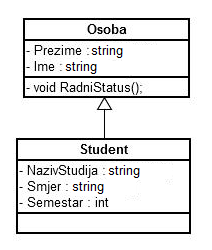

# 16. Osoba i student

Napišite klase kao na sljedećem dijagramu (deklaracije u .h, implementacije u .cpp).

Klasa `Student` koristi javno (public) nasljeđivanje klase `Osoba`, dok podatkovni članovi u obje klase imaju javno pravo pristupa. Također, metoda `RadniStatus`
ispisuje "Osoba nema radni status!". Obje klase je potrebno spremiti u odgovarajuće datoteke na način da se prototipi i deklaracije spreme u `<ime_klase>.h`
datoteke a tijela metoda u `<ime_klase>.cpp` datoteke.

a) U klasi `Osoba` dodajte podatkovni član OIB (string), te konstruktor sljedećeg oblika: `Osoba(string oib);` Navedeni konstruktor postavlja člansku varijablu
OIB na vrijednost predanu parametrom. Sukladno tome, u klasi Student također dodajte odgovarajući konstruktor kojim se inicijalizira pod-objekt `Osoba`.

b) U klasi `Student` napravite prijepis (eng. overriding) metode `RadniStatus` tako da ispisuje "Redovni student".

c) U funkciji main (`main.cpp`) deklarirajte statičko polje `GrupaA` tipa `Student` koje sadrži 5 elemenata. Pri deklaraciji polja svaki element treba inicijalizirati
proizvoljnim OIB-om.

d) Napišite funkciju `int BrojStudenata(Student* p, int elem, int semestar);` koja za predano polje p vraća broj studenata koji se nalazi u traženom semestru.