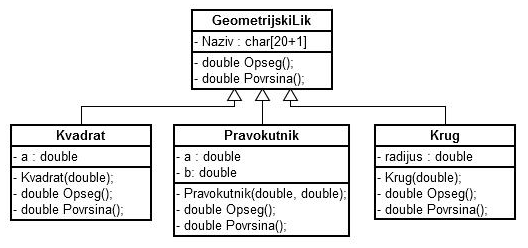

# 18. Geometrijski lik

Napišite deklaracije i implementacije klase kao na sljedećem dijagramu:



Klase `Kvadrat`, `Pravokutnik` i `Krug` koriste javno (public) nasljeđivanje klase `GeometrijskiLik`, dok podatkovni članovi u svim klasama imaju javno pravo
pristupa. Klasa `GeometrijskiLik` je apstraktna tj. njene metode `Opseg` i `Povrsina` su čiste virtualne metode. Zatim, za funkciju `main` kreirajte datoteku
`main.cpp` te u nju napišite sljedeće:

```cpp
#include <iostream>
#include "GeometrijskiLik.h"
#include "Kvadrat.h"
#include "Pravokutnik.h"
#include "Krug.h"

using namespace std;

int main() {
	GeometrijskiLik* Lik[3];
	Kvadrat Kvadrat1(1); // kvadrat sa stranicama duljine 1
	Pravokutnik Pravokutnik1(1, 2); // pravokutnik sa stranicama duljine 1 i 2
	Krug Krug1(1); // krug sa radijusom 1

	Lik[0] = &Kvadrat1;
	Lik[1] = &Pravokutnik1;
	Lik[2] = &Krug1;
	
	for (int i = 0; i < 3; i++)
		cout << Lik[i]->Naziv << " O=" << Lik[i]->Opseg() << " P=" << Lik[i]->Povrsina() << endl;
	
	return 0;
}
```

Ispisi redom trebaju biti:

```
Kvadrat O=4 P=1
Pravokutnik O=6 P=2
Krug O=6.28 P=3.14
```